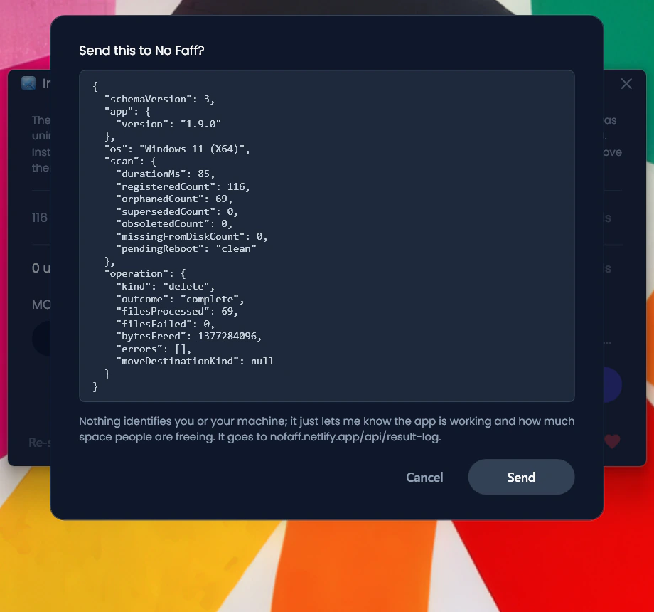

<p align="center">
  <a href="README.md">English</a> · <a href="README.zh-CN.md">简体中文</a> · <a href="README.ru.md">Русский</a> · <a href="README.es.md">Español</a> · <a href="README.pt-BR.md">Português (BR)</a> · <a href="README.fr.md">Français</a> · <a href="README.ja.md">日本語</a> · <strong>한국어</strong> · <a href="README.de.md">Deutsch</a> · <a href="README.it.md">Italiano</a>
</p>

<p align="center"><em>이 페이지는 번역본이지만, 앱 화면은 현재 영어로만 표시됩니다.</em></p>

<p align="center">
  
</p>

<p align="center"><em>🎶 What's my line? I'm happy <a href="https://www.youtube.com/watch?v=HM-jHhUZfFI">cleaning Windows</a></em></p>

<h1 align="center">InstallerClean</h1>

<p align="center"><strong>디스크 공간을 소리 없이 갉아먹는 숨겨진 Windows 폴더 <code>C:\Windows\Installer</code>를 안전하게 정리하는 오픈 소스 도구입니다.</strong></p>

<p align="center"><em>한 번 쓰세요. 어쩌면 공간이 좀 생길지도. 그리고 버리세요.</em></p>

<p align="center">
  <a href="LICENSE"></a>
  <a href="https://dotnet.microsoft.com/download/dotnet/10.0"></a>
  <a href="https://github.com/no-faff/InstallerClean/actions/workflows/ci.yml"></a>
  <a href="https://github.com/no-faff/InstallerClean/releases"></a>
  <a href="https://github.com/no-faff/InstallerClean/releases/latest"></a>
  <a href="https://github.com/no-faff/InstallerClean/releases"></a>
</p>


- **개요:** InstallerClean은 한 가지 일만 합니다. Windows가 한 번도 정리하지 않는 숨겨진 폴더 `C:\Windows\Installer`에서 불필요한 파일을 제거합니다. 거의 즉시 끝나는 검사 후, 그런 파일이 있는지 알려 주고, 궁금한 분께는 더 자세한 내용을 보여 주며, 그 파일을 삭제해 C: 드라이브 공간을 확보할 수 있게 합니다. 한 번 쓰고 나면 그걸로 끝입니다.
- **얼마나 비워지나:** 지금까지 (자발적으로) 보내 주신 보고서에 따르면, <!-- reports-freedpct-start -->41%<!-- reports-freedpct-end -->의 컴퓨터에 정리할 불필요한 파일이 있었습니다. 그중 확보된 공간의 중앙값은 <!-- reports-median-start -->22 GB<!-- reports-median-end -->입니다. 수백 GB를 비운 경우도 몇 있었습니다. 제 경우에는 1.28 GB였습니다. 나머지 <!-- reports-nothingpct-start -->59%<!-- reports-nothingpct-end -->는 제거할 것을 찾지 못했는데, 이는 그저 Installer 폴더가 이미 깨끗했다는 뜻일 뿐입니다. 자세한 내용은 아래 [자주 묻는 질문](#자주-묻는-질문)을 참고하세요.
- **안전한가요:** 네. 어떤 파일이 아직 필요한지를 Windows Installer API에 직접 물어보고, Windows가 다 썼다고 보고한 파일만 목록에 올립니다. 오픈 소스(MIT)이며 사용자에 대해 아무것도 묻지 않습니다. 계정도, 광고도, 추적도, 텔레메트리도 없고, 백그라운드에서 도는 것도 없습니다. 스스로 인터넷에 접속하는 일도 절대 없습니다.
- **받기:** [최신 릴리스를 다운로드하세요](../../releases/latest). 실행하고, [Windows의 경고](#unknown-publisher)와 [관리자 권한 요청](#admin)을 클릭해서 넘어가세요. 불필요한 파일을 삭제하세요. 끝입니다.

## 목차

- [아무도 알려주지 않는 폴더](#아무도-알려주지-않는-폴더)
- [도움을 찾아서](#도움을-찾아서)
- [하는 일](#하는-일)
- [스크린샷](#스크린샷)
- [작동 방식](#작동-방식)
- [안전한가요?](#안전한가요)
- [C:\Windows\Installer에서 파일이 사라졌다면](#recovery)
- [접근성](#접근성)
- [하지 않는 일](#하지-않는-일)
- [자주 묻는 질문](#자주-묻는-질문)
- [다운로드](#다운로드)
- [PatchCleaner와 비교](#patchcleaner와-비교)
- [명령줄](#명령줄)
- [요구 사항](#요구-사항)
- [소스에서 빌드](#소스에서-빌드)
- [기여](#기여)
- [프로젝트 후원](#프로젝트-후원)
- [스타 히스토리](#스타-히스토리)
- [라이선스](#라이선스)

---

## 아무도 알려주지 않는 폴더

모든 Windows PC에는 `C:\Windows\Installer`라는 숨겨진 폴더가 있습니다. Windows Installer 방식을 사용하는 소프트웨어를 설치하거나, Microsoft Office, Adobe Acrobat, Visual Studio를 비롯한 `.msi` 기반 애플리케이션에 패치를 적용할 때마다, 그 설치 관리자나 `.msp` 패치 파일의 사본이 이 폴더에 들어가 그대로 남습니다.

소프트웨어를 제거해도 파일은 남습니다. 새 패치가 옛 패치를 대체해도 둘 다 남습니다. Windows는 이를 절대 정리하지 않습니다. 디스크 정리도 건드리지 않습니다. DISM은 전혀 다른 폴더를 위한 도구입니다. 시간이 지나면서 폴더는 1 GB, 5 GB, 20 GB, 50 GB로 점점 커집니다. MSI를 많이 쓰는 소프트웨어가 깔린 컴퓨터(Acrobat이 흔한 원인입니다)에서는 [100 GB를 넘기기도](https://www.reddit.com/r/sysadmin/comments/1oxcrmh/acrobat_filling_up_the_cwindowsinstaller_folder/) 합니다.

이들은 알아서 다시 생기는 임시 파일이 아닙니다. 몇 년 전 제거한 소프트웨어의 오래된 설치 관리자, 여러 번에 걸쳐 대체된 패치 같은, 말 그대로 군더더기입니다. 한 번 사라지면 다시 돌아오지 않습니다.

**Windows에서 디스크 공간을 손쉽게 확보할 방법을 찾고 있다면, 이 폴더가 좋은 출발점입니다.** InstallerClean은 불필요한 파일을 찾아 안전하게 제거합니다.

## 도움을 찾아서

이 폴더에 관해 한 번이라도 도움을 찾아본 적이 있다면, 그 과정이 어떻게 흘러가는지 아실 겁니다. `C:\Windows\Installer`에 180 GB를 떠안은 누군가가 정리 방법을 묻습니다. [디스크 정리를 돌려 보라는 답을 듣습니다](https://learn.microsoft.com/en-us/answers/questions/4238108/windows-installer-folder-has-occupied-180gb). 해 봅니다. 600 MB가 비워지지만 그 폴더에서 나온 건 하나도 없습니다(디스크 정리는 `C:\Windows\Installer`를 건드리지 않으니까요). 그러고는 글타래가 조용해집니다.

> *"제가 찾은 글타래는 하나같이 문제를 해결하지 못하는 똑같은 방법만 권하다가, 그대로 대화가 끊겨 버립니다."*
>
> [ksparks519, r/Windows10](https://www.reddit.com/r/Windows10/comments/1bt8c5p/anyone_ever_figure_out_giant_installer_folders/) (영어 원문에서 번역)

아니면 아예 건드리지 말라는 말을 듣기도 합니다. 어떤 글타래에서는 60 GB짜리 Installer 폴더를 가진 사람이 ["건드리지 마세요."](https://www.reddit.com/r/techsupport/comments/1hw4suq/my_windows_installer_folder_is_like_60gb_so_i/)라는 말을 들었습니다. 그럼 대신 어떻게 해야 하느냐고 묻자, 돌아온 답은 *"방금 말했잖아요."*였습니다.

흔한 조언은 파일을 마구잡이로 지우는 일(이건 정말 위험합니다)과 Windows 스스로 더 이상 필요 없다고 말하는 파일을 제거하는 일(이건 위험하지 않습니다)을 혼동합니다. InstallerClean이 하는 건 후자입니다.

## 하는 일

1. `C:\Windows\Installer`에서 `.msi`와 `.msp` 파일을 **검사**합니다
2. Windows Installer API에 **질의**해 어떤 파일이 아직 등록되어 있는지 확인합니다
3. 얼마를 확보할 수 있고 얼마가 아직 필요한지 **보여 줍니다**. 모든 파일을 나열하는 세부 창도 선택적으로 열 수 있습니다
4. 불필요한 파일을 **제거**합니다. 휴지통으로 삭제하거나, 직접 고른 폴더로 이동합니다

## 스크린샷

<p>
  <br>
  <em>첫 검사. 아주 빠릅니다.</em>
  <br><br>
</p>

<p>
  <br>
  <em>결과: 얼마가 아직 필요하고 얼마를 제거할 수 있는지.</em>
  <br><br>
</p>

<p>
  <br>
  <em>아직 필요한 파일의 세부 정보. 설치 관리자 데이터베이스에서 읽은 메타데이터가 함께 표시됩니다.</em>
  <br><br>
</p>

<p>
  <br>
  <em>더 이상 필요 없는 파일의 세부 정보.</em>
  <br><br>
</p>

<p>
  <br>
  <em>어느 작업이든 실행 전에 확인을 거칩니다. 삭제는 휴지통으로 보내고, 이동은 직접 고른 위치에 파일을 둡니다.</em>
  <br><br>
</p>

<p>
  <br>
  <em>삭제에 성공한 뒤.</em>
  <br><br>
</p>

<p>
  <br>
  <em>다시 검사한 뒤. 정리할 것이 남아 있지 않습니다.</em>
  <br><br>
</p>

## 작동 방식

InstallerClean은 불필요한 파일을 세 종류로 구분해 찾아냅니다.

**고아 파일**은 소프트웨어를 제거한 뒤 남겨진 `.msi` 설치 관리자(그리고 딸린 `.msp` 패치)입니다. Windows는 더 이상 이들을 참조하지 않지만, 파일은 폴더에 남아 공간을 차지합니다.

**대체된 패치**는 더 새로운 패치로 교체된 옛 `.msp` 패치입니다. Windows는 자체 데이터베이스에 이를 대체됨으로 표시하지만 절대 삭제하지 않습니다. 패치를 자주 내놓는 공급업체(Acrobat, Office, 대형 개발 도구)에서는 대체된 패치가 끝없이 쌓입니다.

**폐기된 패치**는 게시자가 더 새로운 버전으로 교체하는 대신 철회하거나 지원 중단한 `.msp` 패치입니다. Windows는 그 상태도 기록하지만, 마찬가지로 파일을 폴더에 그대로 둡니다.

이들을 찾기 위해 InstallerClean은 P/Invoke를 통해 Windows Installer COM 인터페이스를 직접 호출합니다.

- `MsiEnumProductsEx`로 설치된 모든 제품을 열거합니다
- `MsiEnumPatchesEx`로 각 제품에 등록된 모든 패치를 찾습니다
- `MsiGetPatchInfoEx`로 패치 상태(적용됨, 대체됨, 폐기됨)를 읽습니다

`C:\Windows\Installer`에 있는 `.msi`나 `.msp` 파일 중 등록된 어떤 제품도 필요로 하지 않는 것은 고아 파일이며 제거 가능으로 표시됩니다. 데이터베이스가 대체됨이나 폐기됨으로 표시했고 설치 제거에 필요하지 않은 패치도 마찬가지입니다.

API가 불완전한 데이터를 반환하면(드물지만 설치 관리자 상태가 손상되면 일어날 수 있습니다), 앱은 레지스트리 읽기로 물러섭니다. 이 대비책은 "아직 필요한" 묶음에만 파일을 더할 뿐, "제거 가능" 묶음에는 절대 더하지 않습니다.

이동이나 삭제가 끝나면, `C:\Windows\Installer` 안의 빈 하위 폴더(내용물이 사라진 뒤 캐시가 남기는 디렉터리)도 같은 작업에서 함께 정리됩니다.

## 안전한가요?

네. InstallerClean은 Windows가 무엇이 설치되어 있는지 추적할 때 쓰는 바로 그 Windows Installer API 데이터베이스에 질의합니다. Windows가 어떤 파일이 더 이상 필요 없다고 하면 앱은 그 말을 믿습니다. 파일 이름이나 날짜로 추측하지 않습니다.

**삭제와 이동에 관하여.** InstallerClean이 삭제하는 파일은 영구히 지워도 안전합니다. **삭제**는 파일을 휴지통으로 보냅니다(휴지통을 쓸 수 없으면 알려 드립니다). 휴지통을 비우면 그만큼의 공간이 C: 드라이브로 돌아옵니다.

그렇지만 파일이 삭제해도 안전하다는 걸 제 말만 믿으실 필요는 없습니다. 파일이 휴지통에 있는 동안, 이 폴더를 쓰는 앱들, 즉 Office, Acrobat, Visual Studio 같은 프로그램이 여전히 문제없이 업데이트되고 제거되는지 확인할 기회가 있습니다. 혹시 뭔가 망가졌다면(그럴 일 없습니다!) 휴지통에서 파일을 복원해 되돌리면 됩니다. 더 확실히 하고 싶다면 대신 **이동**을 써서 파일을 직접 고른 폴더에 보관해 둘 수 있습니다(C: 공간을 비우는 것이 목적이라면 당연히 다른 파티션이나 드라이브에 있는 폴더를 고르세요). 원래대로 되돌리려면 파일을 `C:\Windows\Installer`로 다시 복사하기만 하면 됩니다(하지만 그럴 필요는 없을 겁니다!).

Windows Installer가 지금 캐시에 쓰고 있거나, 이전 트랜잭션이 중단된 상태이거나, 캐시를 대상으로 한 재부팅 후 이름 변경이 대기 중이면, 이동과 삭제가 비활성화되고 구체적인 이유가 표시됩니다.

검사, 질의, 이동, 삭제, 설정, 재부팅 대기 확인 서비스는 커밋할 때마다 실행되는 자동화된 테스트 모음으로 검증됩니다(위의 CI 배지를 참고하세요).

**바이너리 검증.** InstallerClean은 서명되어 있지 않으므로, 그냥 믿고 쓰실 필요가 없습니다.

- 각 릴리스의 SHA-256 해시는 [릴리스 페이지](../../releases/latest)에 올려 두었습니다.
- VirusTotal: 모든 엔진에서 깨끗합니다. 각 릴리스 노트에 직접 다시 확인할 수 있는 링크가 있습니다.
- 소스는 [github.com/no-faff/InstallerClean](https://github.com/no-faff/InstallerClean)에 있고, CI가 모든 커밋을 빌드하고 테스트합니다(위의 초록색 CI 배지를 참고하세요).
- GitHub, MajorGeeks, Softpedia를 통틀어 <!-- downloads-start -->23k<!-- downloads-end --> 회 다운로드되었습니다.
- [MajorGeeks](https://www.majorgeeks.com/files/details/installerclean.html)는 제출된 각 파일을 가상 머신에서 테스트하고, 자체 검토를 통과한 경우에만 목록에 올립니다.
- [Softpedia](https://www.softpedia.com/get/System/Hard-Disk-Utils/InstallerClean.shtml)는 각 릴리스를 바이러스, 스파이웨어, 애드웨어에 대해 검사합니다.

<a href="https://www.softpedia.com/get/System/Hard-Disk-Utils/InstallerClean.shtml"></a>

<a id="recovery"></a>
## `C:\Windows\Installer`에서 파일이 사라졌다면

InstallerClean은 Windows 스스로 더 이상 필요 없다고 보고한 파일만 제거하므로, 파일이 사라진 원인이 되는 일은 결코 없습니다. 하지만 이미 사라진 파일이 있다면 InstallerClean이 이를 감지해 알려 줍니다. 해결 방법은 다음과 같습니다.

해당 프로그램의 설치 관리자를 제작사에서 내려받아, 기존 설치 위에 그대로 실행하세요. 먼저 제거하지 마세요. 가능하면 지금 쓰고 있는 것과 같은 버전을 쓰세요. Windows가 다른 버전은 거부할 수 있기 때문입니다. 보통은 이렇게 하면 파일이 다시 제자리에 돌아오고 설정은 그대로 유지됩니다. InstallerClean에서 다시 검사하면, 제대로 됐을 경우 경고가 사라져 있을 겁니다.

보통은 이 방법이 통합니다. 아래는 Microsoft가 직접 내놓은 더 자세한 설명입니다. 공식적인 세부 내용과, 그렇게 간단히 풀리지 않을 때의 더 까다로운 경우를 다룹니다. 어느 것도 InstallerClean 탓이 아니며, 제가 Microsoft의 안내보다 더 나은 설명을 내놓을 수도 없으니, 그대로 전해 드립니다.

<details>
<summary>Microsoft의 더 자세한 입장</summary>

*아래 Microsoft 인용문은 영어 원문 그대로 싣습니다.*

전체 안내: [Restore missing Windows Installer cache files](https://learn.microsoft.com/en-us/troubleshoot/windows-client/application-management/missing-windows-installer-cache).

*바로 드러나지 않을 수 있습니다:*
> "If the installer cache is compromised, you may not immediately see problems until you take an action such as uninstalling, repairing, or updating a product."

*파일은 컴퓨터마다 고유하므로 다른 PC에서 복사해 올 수 없습니다:*
> "Missing files cannot be copied between computers because the files are unique."

*백업에서 그 파일만 꺼내 올 수도 없습니다:*
> "To restore the missing files, a full system state restoration is required. It is not possible to replace only the missing files from a previous backup."

*권장되는 복구 방법과, 그 가차 없는 한계:*
> "If application files are missing from the Windows Installer Cache, ask the vendor or support team for the application about the missing files. You must follow the procedures or steps recommended by the application vendor to restore the files. In some cases, you may have to rebuild the operating system and reinstall the application to fix the problem."
>
> "Windows support engineers cannot help you recover missing application files from the Windows Installer cache."

*같은 버전이 중요한 이유:*
> "The upgrade cannot be installed by the Windows Installer service because the program to be upgraded may be missing, or the upgrade may update a different version of the program."

</details>

## 접근성

InstallerClean은 키보드만으로도, 스크린 리더와 함께도 완전히 사용할 수 있도록 만들어졌습니다.

- **전체를 키보드로 조작할 수 있습니다.** Tab으로 모든 컨트롤에 닿을 수 있고, 세부 창의 열도 키보드로 정렬할 수 있어, 마우스가 필요한 곳이 없습니다. 키보드 포커스는 어디로 가든 항상 보입니다.
- **내레이터와 음성 액세스.** 모든 컨트롤에 레이블이 붙어 있고, 버튼에 보이는 단어가 곧 음성으로 그 버튼을 실행하는 단어입니다. 이동이나 삭제가 끝나면 그 결과를 소리 내어 읽어 줍니다.
- **읽기 좋게 만들었습니다.** 텍스트는 어두운 테마 전반에서 WCAG AA 명암 대비 기준을 충족합니다.

여기서 무언가 불편을 준다면 [이슈를 열어 주세요](../../issues). 접근성 문제는 사소한 예외가 아니라 버그입니다.

## 하지 않는 일

- WinSxS(`C:\Windows\WinSxS`)는 규칙이 다른 별개의 폴더입니다. 그 폴더는 관리자 권한 프롬프트에서 `Dism /Online /Cleanup-Image /StartComponentCleanup`을 실행하세요.
- 백그라운드 서비스도, 예약 작업도, 자동 정리도 없습니다. 앱은 직접 실행할 때만 동작합니다.
- 레지스트리는 읽기 전용입니다. 앱은 Windows Installer 데이터베이스에 질의할 뿐, 바꾸지 않습니다.
- 인터넷에 접속하는 건 사용자가 시킬 때뿐입니다. 수동 업데이트 확인, 선택적인 익명 요약(그저 앱이 잘 돌아간다고 제게 알려 주는 용도), 그리고 GitHub 문서와 후원 페이지로 가는 링크(클릭을 택하면 브라우저에서 열립니다)입니다.
- 툴바도, 끼워 파는 소프트웨어도, 애드웨어도 없습니다.

## 자주 묻는 질문

**정말 몇 GB씩 공간이 비워질까요?** 컴퓨터에 따라 다릅니다. 추가 소프트웨어 없이 갓 설치한 Windows 11에는 제거할 것이 없습니다. 오래 써 온 개발자 워크스테이션이나, MSI 기반 소프트웨어를 많이 쓰는 컴퓨터(Acrobat, Office, LibreOffice, 대형 개발 도구)라면 수십 GB가 나올 수도 있습니다. 어느 쪽이든, 실행하는 순간 정확히 얼마인지 보게 됩니다.

<!-- reports-stats-start (generated by non-repo-files/refresh-reports-table.mjs; do not hand-edit between these markers) -->
v1.8.0에서 이 옵션이 추가된 이후 보내 주신 87건의 보고서(감사합니다 🙏)를 집계한 결과입니다:

| 결과 | 비율 | 최소 | 중앙값 | 최대 |
|---|---|---|---|---|
| 제거할 것 없음 | 59% | - | - | - |
| 공간 확보 | 41% | 0.1 GB | 22 GB | 327 GB |
<!-- reports-stats-end -->

<details>
<summary>이 보고서는 선택 사항인 "요약 보내기" 버튼을 통해 전송됩니다. 무언가 전송되기 전에 보게 될 내용은 다음과 같습니다.</summary>



</details>

<a id="admin"></a>

**왜 관리자 권한이 필요한가요?** `C:\Windows\Installer`는 관리자만 접근할 수 있도록 잠겨 있습니다. 이 폴더를 읽고, 설치 관리자 데이터베이스에 질의하고, 파일을 이동하거나 삭제하는 일 모두 관리자 권한이 필요하므로, 앱은 관리자로 실행되어야 합니다.

<a id="unknown-publisher"></a>

**왜 Windows가 "알 수 없는 게시자"라고 하나요?** InstallerClean이 코드 서명되어 있지 않기 때문입니다. 서명 인증서는 해마다 비용이 들고, 저는 그 돈을 내느니 앱을 무료로 유지하고 싶습니다. 그래서 실행하면 Windows SmartScreen이 "Windows의 PC를 보호했습니다"라고 표시합니다. **추가 정보**를 클릭한 다음 **실행**을 클릭하세요. 그렇게 해도 안전합니다. 소스 코드가 공개되어 있고, 모든 릴리스에 미리 확인할 수 있는 VirusTotal 링크와 SHA-256 해시가 있습니다.

**삭제를 되돌릴 수 있나요?** 보통은 가능합니다. 드라이브에서 휴지통을 쓸 수 있으면 삭제는 파일을 휴지통으로 보내고, 거기서 복원할 수 있습니다. 휴지통을 쓸 수 없으면, 앱은 스스로 파일을 영구히 지우는 일이 결코 없습니다([안전한가요?](#안전한가요) 참고). 그리고 직접 통제할 수 있는 되돌림 수단을 원한다면, 이동이 직접 고른 폴더에 파일을 넣어 주니, 마음이 놓일 때 거기서 지우면 됩니다.

**이 파일을 제거하면 Windows가 불평하나요?** 아니요. InstallerClean은 Windows 스스로 다 썼다고 보고한 파일만 제거하므로, 제거하는 것 중에 프로그램을 복구하거나 업데이트하거나 제거하는 데 필요한 것은 없습니다. 혹시 다른 경로로 필요한 파일이 `C:\Windows\Installer`에서 사라졌다면 [`C:\Windows\Installer`에서 파일이 사라졌다면](#recovery)을 참고하세요.

**왜 `Win32_Product`(WMI)를 안 쓰나요?** [`Win32_Product`는 열거 도중 모든 제품에 대해 MSI 복구 작업을 일으키며](https://gregramsey.net/2012/02/20/win32_product-is-evil/), 이는 몇 분이 걸리고 디스크에 큰 부하를 줄 수 있습니다. InstallerClean은 부작용 없이 Windows Installer COM API를 직접 호출합니다.

**그냥 PowerShell 스크립트면 안 되나요?** `MsiEnumPatchesEx`를 호출하는 짧은 스크립트로도 패치를 *나열*하기에는 충분합니다. 하지만 InstallerClean의 핵심을 떠받치는 부분은 스크립트가 대충 넘기는 것들입니다. 고아냐 대체됐냐의 분류, "아직 필요한" 묶음에만 파일을 더하는("제거 가능"에는 절대 더하지 않는) 레지스트리 대비책, 재부팅 대기 시의 차단, 다른 곳으로 이동하는 안전망, 취소할 수 있는 파일별 진행 표시, 그리고 영구 삭제가 아닌 휴지통을 기본값으로 두는 동작 같은 것들이죠. MSI를 정말 많이 쓰는 실제 컴퓨터에서의 예외 상황(손상된 등록 정보, 캐시 안의 정션, `HKU\.DEFAULT`에 있는 제품, 중단된 설치 관리자 트랜잭션)은 일회용 스크립트에서 잘못 처리하기 쉽습니다. 스크립트로 다루고 싶다면 `installerclean-cli`가 그 무인 실행용 도구입니다.

**Windows 7이나 8에서 동작하나요?** 테스트하지 않았고 지원하지 않습니다. Windows 10과 11을 대상으로 합니다.

**RMM이나 대규모 배포에 적합한가요?** 네. CLI는 결과에 따라 서로 다른 종료 코드를 반환합니다(0 성공, 2 부분 성공, 1 심각한 실패, 75 일시적 상태, 130 파일을 하나도 처리하기 전의 Ctrl+C. 배치 도중에 Ctrl+C가 들어오면 이미 작업이 이뤄졌으므로 2로 종료합니다). 그래서 예약 작업이 75일 때만 재시도하고 심각한 실패와 뒤섞지 않을 수 있습니다. 실행할 때마다 요약 한 건을 응용 프로그램 이벤트 로그에 기록하고, GUI와 같은 단일 인스턴스 뮤텍스를 따릅니다. 설치 관리자도 Inno Setup 표준 스위치(`/SILENT` 또는 `/VERYSILENT`)로 자동 설치됩니다. 자동 설치 시에는 설치 후 실행을 건너뜁니다. 명령줄 섹션을 참고하세요.

## 다운로드

세 가지 빌드 중 하나를 고르세요:

- **Setup**(`InstallerClean-setup.exe`): .NET 10 런타임을 함께 담은 일반 Windows 설치 관리자입니다. 시작 메뉴 항목을 추가하고 깔끔하게 제거됩니다. 프로그램 목록에 자리 잡아 두니 여섯 달 뒤에도 찾기 쉽습니다.
- **Portable**(`InstallerClean-portable.exe`): 런타임을 함께 담은 단일 자체 포함 exe입니다. 설치도, 제거 관리자도 없습니다. 실행하고, 쓰고, 지우세요. 필요하면 언제든 다시 실행하면 됩니다.
- **CLI**(`installerclean-cli.exe`): 명령줄 버전만 따로 떼어 낸, 단일 자체 포함 exe입니다. 설치가 없고, 끝난 뒤 컴퓨터에 아무것도 남지 않습니다. 클라이언트에 올려 검사나 정리를 실행하고 지우세요. 클라이언트에 데스크톱 앱을 두지 않고 작업만 하고 싶을 때를 위한, 스크립트와 예약 작업과 대규모 배포용입니다. 인수와 종료 코드는 [명령줄](#명령줄)을 참고하세요.

[릴리스 페이지](../../releases/latest)에서 내려받아 실행하세요. 서명되어 있지 않아 Windows가 "알 수 없는 게시자" 경고를 표시합니다. 무엇이 보이고 왜 안전한지는 [자주 묻는 질문](#unknown-publisher)에서 설명합니다.

앱은 시작할 때 자동으로 검사합니다. 결과를 살펴본 다음 **삭제**나 **이동**을 클릭하세요.

또는 [winget](https://learn.microsoft.com/windows/package-manager/winget/)으로 설치하세요:

```
winget install NoFaff.InstallerClean
```

또는 [Scoop](https://scoop.sh)으로 설치하세요:

```
scoop bucket add no-faff https://github.com/no-faff/scoop-bucket
scoop install installerclean
```

## PatchCleaner와 비교

이 폴더를 전에 검색해 본 적이 있다면, 십중팔구 찾았을 도구는 [PatchCleaner](https://www.homedev.com.au/free/patchcleaner)일 겁니다. 지금도 잘 돌아가지만, 제가 InstallerClean을 만든 건 PatchCleaner가 비공개 소스이고, 2016년 3월 이후로 업데이트가 없으며, 기본적으로 Adobe 제품을 건드리지 않기 때문입니다. PatchCleaner의 고아 판정이 Adobe 패치를 잘못 짚어, 그것을 제거하면 Adobe 업데이트가 망가졌습니다. 그래서 필터를 끄지 않는 한 Adobe 파일은 전부 그대로 둡니다. Adobe가 가장 큰 골칫거리인 컴퓨터에서는, 바로 거기에 대부분의 공간이 묶여 있습니다:

> *"고아가 된 `.msp` 파일을 지우려고 PatchCleaner를 받았는데, 이걸로는 250 MB밖에 못 비운다네요. 파일 중 29 GB가 '필터로 제외'되어서, PatchCleaner는 별 도움이 안 되는 것 같습니다."*
>
> HeatherBunny1111, [r/techsupport](https://www.reddit.com/r/techsupport/comments/1qc4tcf/how_to_delete_msp_files_safely/) (영어 원문에서 번역)

InstallerClean은 Windows Installer 자체의 패치 기록을 읽으므로, 어떤 Adobe 패치가 정말로 대체됐는지 가려내어 일괄 필터 없이 안전하게 정리할 수 있습니다. 두 도구를 비교하면 다음과 같습니다:

| | **InstallerClean** | **PatchCleaner** |
|---|---|---|
| 최종 업데이트 | 2026년(활발히 개발 중) | 2016년 3월 3일 |
| 소스 코드 | 오픈 소스(MIT) | 비공개 소스 |
| 런타임 | .NET 10(자체 포함) | .NET + VBScript |
| API | Windows Installer COM(프로세스 내) | Windows Installer COM(VBScript를 통한 프로세스 외부) |
| 대체된 패치 감지 | 있음 | 없음 |
| Adobe 처리 | 대체된 패치를 감지 | 기본적으로 제외 |
| UI | 어두운 테마(WPF) | Windows Forms |
| 데이터 수집 | 없음 | 없음 |
| 삭제 안전성 | 휴지통. 쓸 수 없으면 이동할지 영구 삭제할지 물어봄 | 영구 삭제, 휴지통 없음 |

> **`Win32_Product`에 관한 참고:** 설치된 제품을 나열하는 흔하지만 결함 있는 방법이 `Win32_Product`(WMI)입니다. 이는 열거 도중 [모든 제품에 대해 MSI 복구 작업을 일으킵니다](https://gregramsey.net/2012/02/20/win32_product-is-evil/). InstallerClean과 PatchCleaner 둘 다 이를 피합니다. 둘 다 Windows Installer COM 인터페이스를 씁니다. PatchCleaner 스크립트의 `WMIProducts.vbs`라는 파일 이름은 오해를 부르지만, 그 스크립트는 WMI가 아니라 MSI COM을 씁니다.

[Ultra Virus Killer (UVK)](https://www.carifred.com/uvk/)도 System Booster 모듈의 일부로 Installer 정리 기능을 제공하지만, 유료 도구(15~25달러)이고 그 정리 기능은 훨씬 큰 애플리케이션 안의 작은 기능 하나일 뿐입니다. InstallerClean은 무료이고, 한 가지에 집중하며, 오픈 소스입니다.

[CCleaner](https://www.ccleaner.com/)나 [BleachBit](https://www.bleachbit.org/) 같은 범용 시스템 클리너는 `C:\Windows\Installer`를 건드리지 않습니다. 이 폴더는 등록된 패키지와 불필요한 것을 가려내는 데 Windows Installer API 질의가 필요하고, 그저 파일 트리만 훑는 범용 클리너는 설치된 앱을 망가뜨릴 수 있기 때문입니다. 바로 그 폴더를 정리하고 싶을 때 손이 가야 할 도구가 InstallerClean입니다.

## 명령줄

InstallerClean은 스크립트와 시스템 관리 용도를 위한 무인(헤드리스) 실행을 지원합니다:

```
사용법:
  installerclean-cli --help   이 도움말을 표시(/?, -h도 사용 가능)
  installerclean-cli --version  버전을 출력(-v도 사용 가능)
  installerclean-cli /s       검사만 수행. 제거 가능한 파일을 나열
  installerclean-cli /d       제거 가능한 파일을 삭제(휴지통)
  installerclean-cli /m       저장된 기본 위치로 이동
  installerclean-cli /m PATH  지정한 경로로 이동
```

GUI를 실행하려면 `InstallerClean.exe`를 실행하세요(또는 Setup으로 설치한 경우 시작 메뉴 바로 가기를 쓰세요).

인수 없이, 또는 인식되지 않는 플래그로 실행하면 `installerclean-cli`는 이 사용법을 출력하고 `1`로 종료합니다. 그래서 플래그를 빠뜨린 예약 작업은 아무 일도 안 하면서 조용히 성공하는 대신 눈에 띄게 실패합니다. 명시적으로 `--help`, `/?`, `-h`를 주면 같은 사용법을 출력하고 `0`으로 종료합니다.

`/s`는 시험 실행입니다. 검사한 뒤 제거할 파일을 이름과 크기와 함께 나열하고 종료합니다. 정리 전에 점검할 때 유용합니다. 종료 코드는 검사 성공 시 `0`, 검사 실패 시 `1`, Ctrl+C 시 `130`입니다. 모든 파일은 `C:\Windows\Installer`에 있습니다.

`/d`와 `/m`은 검사한 다음 실행합니다. `/d`는 제거 가능한 파일을 휴지통으로 보냅니다. `/m`은 파일을 폴더로 이동합니다(명령줄에서 지정한 폴더, 또는 GUI에서 저장한 기본 위치). 종료 코드: `0` 완전 성공, `2` 부분 성공(일부 파일은 성공, 일부는 실패), `1` 전체 실패(검사 실패, 잘못된 인수, 또는 배치의 모든 파일 실패), `75` 실행을 막은 일시적 상태(출력된 메시지가 어떤 상태인지와 재시도가 도움이 될지 설명합니다), `130` 파일을 하나도 처리하기 전의 Ctrl+C(배치 도중에 들어온 Ctrl+C는 이미 작업이 이뤄졌으므로 `2`, 즉 부분 성공으로 종료합니다).

오류와 진단 메시지를 포함한 CLI의 모든 출력은 stdout으로 나갑니다. 별도의 stderr 스트림은 없습니다. 종료 코드가 기계가 읽을 수 있는 신호이며(실행별 응용 프로그램 이벤트 로그 항목도 이를 그대로 반영합니다), 따라서 스크립트는 텍스트를 분석하기보다 종료 코드를 기준으로 삼아야 합니다. 그리고 `installerclean-cli /s > audit.txt`로 하면 오류 줄을 포함한 실행 전체를 담을 수 있습니다.

셋 다 권한이 상승된(관리자) 명령 프롬프트가 필요합니다. 그룹 정책이 UAC 권한 상승 프롬프트를 차단하면 프로세스는 시작을 거부하고, Windows는 상위 셸에 오류 740을 반환합니다(PowerShell에서는 `$LASTEXITCODE = 740`). `taskkill /pid <pid>`는 정상적인 취소를 일으키지 않습니다. 단일 인스턴스 뮤텍스는 다음 실행 때 AbandonedMutexException 경로를 통해 복구됩니다.

참고로 CLI 자체의 출력은 영어입니다. 위 설명은 사용할 수 있는 옵션에 대응합니다.

### 왜 `installerclean.exe`가 아니라 `installerclean-cli`인가요?

`InstallerClean.exe`는 WPF GUI이며 명령줄 인수에 반응하지 않습니다. `installerclean-cli.exe`는 같은 설치 디렉터리에 함께 들어가는 별도의 콘솔 실행 파일로, 동일한 검사 / 이동 / 삭제 작업을 PowerShell, cmd, 예약 작업에 노출합니다. 진짜 콘솔 프로세스이므로 끝날 때까지 프롬프트를 붙잡습니다. 다른 콘솔 exe와 마찬가지로 출력을 리디렉션하거나 파이프로 넘기면 됩니다.

Portable 다운로드에는 GUI exe만 들어 있습니다. GUI 없이 명령줄만 원한다면 [릴리스 페이지](../../releases/latest)에서 `installerclean-cli.exe`를 내려받아 바로 실행하세요. Setup은 이것도 GUI와 함께 설치합니다.

## 요구 사항

- Windows 10(버전 1607 / 빌드 14393 이상, .NET 10 런타임이 지원하는 가장 오래된 버전) 또는 Windows 11
- 관리자 권한(`C:\Windows\Installer`는 관리자 전용입니다)

setup, portable, CLI 빌드 선택지는 [다운로드](#다운로드)를 참고하세요.

## 소스에서 빌드

```
git clone https://github.com/no-faff/InstallerClean.git
cd InstallerClean
dotnet build src/InstallerClean.sln
```

테스트를 실행하려면:

```
dotnet test src/InstallerClean.Tests/
```

## 기여

버그를 찾았거나 제안할 것이 있나요? [이슈를 열](../../issues)거나 [토론](../../discussions)을 시작하세요. 풀 리퀘스트는 환영합니다. 제출하기 전에 `dotnet test`를 실행해 주세요.

## 프로젝트 후원

InstallerClean이 도움이 됐다면, [No Faff 후원](https://nofaff.netlify.app/support)을 생각해 보시거나 GitHub에 별을 남겨 주세요.

## 스타 히스토리

<a href="https://www.star-history.com/?repos=no-faff%2FInstallerClean&type=date&legend=top-left">
 <picture>
   <source media="(prefers-color-scheme: dark)" srcset="https://api.star-history.com/chart?repos=no-faff/InstallerClean&type=date&theme=dark&legend=top-left" />
   <source media="(prefers-color-scheme: light)" srcset="https://api.star-history.com/chart?repos=no-faff/InstallerClean&type=date&legend=top-left" />
   
 </picture>
</a>

## 라이선스

[MIT](LICENSE)

---

🎶 [George Formby - When I'm Cleaning Windows](https://www.youtube.com/watch?v=sfmAeijj5cM). 즐겨 보세요!
