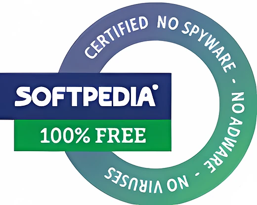

<p align="center">
  <a href="README.md">English</a> · <a href="README.zh-CN.md">简体中文</a> · <a href="README.es.md">Español</a> · <a href="README.ja.md">日本語</a> · <a href="README.pt-BR.md">Português (BR)</a> · <strong>Русский</strong> · <a href="README.fr.md">Français</a> · <a href="README.it.md">Italiano</a>
</p>

<p align="center"><em>Эта страница переведена, но интерфейс приложения пока доступен только на английском языке.</em></p>

<p align="center">
  
</p>

<p align="center"><em>🎶 What's my line? I'm happy <a href="https://www.youtube.com/watch?v=HM-jHhUZfFI">cleaning Windows</a></em></p>

<h1 align="center">InstallerClean</h1>

<p align="center"><strong>Инструмент с открытым исходным кодом для безопасной очистки <code>C:\Windows\Installer</code> — скрытой папки Windows, которая незаметно съедает место на диске.</strong></p>

<p align="center"><em>Запустите один раз. Может, освободите немного места. И выкиньте.</em></p>

<p align="center">
  <a href="LICENSE"></a>
  <a href="https://dotnet.microsoft.com/download/dotnet/10.0"></a>
  <a href="https://github.com/no-faff/InstallerClean/actions/workflows/ci.yml"></a>
  <a href="https://github.com/no-faff/InstallerClean/releases"></a>
  <a href="https://github.com/no-faff/InstallerClean/releases/latest"></a>
  <a href="https://github.com/no-faff/InstallerClean/releases"></a>
</p>


- **Что это:** InstallerClean делает одно дело: убирает ненужные файлы из `C:\Windows\Installer` — скрытой папки, которую Windows никогда не очищает. После почти мгновенного сканирования он сообщает, есть ли они у вас, показывает подробности для любопытных и позволяет удалить их, чтобы освободить место на диске C:. Запускаете один раз — и идёте дальше.
- **Сколько места:** По присланным (необязательным) отчётам на данный момент у <!-- reports-freedpct-start -->41 %<!-- reports-freedpct-end --> машин нашлись ненужные файлы для очистки. У них медиана освобождённого — <!-- reports-median-start -->22 ГБ<!-- reports-median-end -->. У некоторых очистилось по нескольку сотен гигабайт. У меня — 1,28 ГБ. Остальные <!-- reports-nothingpct-start -->59 %<!-- reports-nothingpct-end --> не нашли ничего лишнего, а это просто значит, что их папка Installer уже была чистой. Подробнее в разделе [Частые вопросы](#частые-вопросы) ниже.
- **Это безопасно:** Да. Он спрашивает у самого API Windows Installer, какие файлы ещё нужны, и показывает только те, что Windows объявляет отработавшими. Это проект с открытым исходным кодом (MIT), и он ничего о вас не спрашивает: ни учётной записи, ни рекламы, ни слежки, ни телеметрии, ничего работающего в фоне. Сам он в сеть никогда не выходит.
- **Как получить:** [Скачайте последнюю версию](../../releases/latest). Запустите, пройдите через [предупреждение Windows](#unknown-publisher) и [запрос прав администратора](#admin). Удалите ненужные файлы. Готово.

## Содержание

- [Папка, о которой вам никто не рассказывает](#папка-о-которой-вам-никто-не-рассказывает)
- [В поисках помощи](#в-поисках-помощи)
- [Что он делает](#что-он-делает)
- [Скриншоты](#скриншоты)
- [Как это работает](#как-это-работает)
- [Это безопасно?](#это-безопасно)
- [Если у вас всё-таки пропал файл из C:\Windows\Installer](#recovery)
- [Доступность](#доступность)
- [Чего он не делает](#чего-он-не-делает)
- [Частые вопросы](#частые-вопросы)
- [Загрузка](#загрузка)
- [Сравнение с PatchCleaner](#сравнение-с-patchcleaner)
- [Командная строка](#командная-строка)
- [Требования](#требования)
- [Сборка из исходного кода](#сборка-из-исходного-кода)
- [Участие в разработке](#участие-в-разработке)
- [Поддержать проект](#поддержать-проект)
- [История звёзд](#история-звёзд)
- [Лицензия](#лицензия)

---

## Папка, о которой вам никто не рассказывает

На каждом компьютере с Windows есть скрытая папка `C:\Windows\Installer`. Каждый раз, когда вы устанавливаете программу, использующую систему Windows Installer, или ставите патч для Microsoft Office, Adobe Acrobat, Visual Studio или любого другого приложения на основе `.msi`, копия этого установщика или файла патча `.msp` попадает в эту папку — и остаётся там.

Когда вы удаляете программу, файлы остаются. Когда новый патч приходит на смену старому, остаются оба. Windows никогда их не убирает. «Очистка диска» их не трогает. DISM работает совсем с другой папкой. Со временем папка растёт: 1 ГБ, 5 ГБ, 20 ГБ, 50 ГБ. На машинах с обилием программ, использующих MSI (Acrobat — частый виновник), она может [перевалить за 100 ГБ](https://www.reddit.com/r/sysadmin/comments/1oxcrmh/acrobat_filling_up_the_cwindowsinstaller_folder/).

Это не временные файлы, которые возвращаются сами собой. Это настоящий балласт: старые установщики программ, удалённых много лет назад, и патчи, которые успели сменить друг друга уже по нескольку раз. Стоит их удалить — и обратно они уже не вернутся.

**Если вы ищете простой способ освободить место на диске в Windows, эта папка — хорошее начало.** InstallerClean находит ненужные файлы и безопасно их удаляет.

## В поисках помощи

Если вы когда-нибудь искали помощь по этой папке, то, наверное, знаете, как это бывает. Кто-то с 180 ГБ в `C:\Windows\Installer` спрашивает, как её очистить. Ему [советуют запустить «Очистку диска»](https://learn.microsoft.com/en-us/answers/questions/4238108/windows-installer-folder-has-occupied-180gb). Он пробует. Очищается 600 МБ, и ни байта из той самой папки (потому что «Очистка диска» не трогает `C:\Windows\Installer`). И на этом обсуждение замирает.

> *«Во всех ветках, которые мне попадались, обычно советуют одно и то же, и это не решает проблему, а потом обсуждение глохнет.»*
>
> [ksparks519, r/Windows10](https://www.reddit.com/r/Windows10/comments/1bt8c5p/anyone_ever_figure_out_giant_installer_folders/) (перевод с английского)

Или же ему советуют вообще её не трогать. В одной из веток человеку с папкой Installer на 60 ГБ ответили: [«не трогай её»](https://www.reddit.com/r/techsupport/comments/1hw4suq/my_windows_installer_folder_is_like_60gb_so_i/). Когда он спросил, что же тогда делать, ответ был: *«Я же только что сказал».*

Стандартный совет путает удаление файлов наугад (что действительно опасно) с удалением файлов, которые сам Windows объявляет больше не нужными (а это уже не опасно). InstallerClean занимается вторым.

## Что он делает

1. **Сканирует** `C:\Windows\Installer` в поисках файлов `.msi` и `.msp`
2. **Запрашивает** у API Windows Installer, какие файлы всё ещё зарегистрированы
3. **Показывает**, сколько можно освободить и сколько ещё нужно, с дополнительными окнами подробностей, где перечислен каждый файл
4. **Удаляет** ненужные файлы: отправляет в Корзину или перемещает в выбранную вами папку

## Скриншоты

<p>
  <br>
  <em>Первичное сканирование. Проходит очень быстро.</em>
  <br><br>
</p>

<p>
  <br>
  <em>Результаты: сколько ещё нужно, а сколько можно удалить.</em>
  <br><br>
</p>

<p>
  <br>
  <em>Подробности о файлах, которые ещё нужны, с метаданными из базы установщика.</em>
  <br><br>
</p>

<p>
  <br>
  <em>Подробности о файлах, которые больше не нужны.</em>
  <br><br>
</p>

<p>
  <br>
  <em>Подтверждение перед любым из действий. Удаление отправляет в Корзину, перемещение кладёт файлы туда, куда вы выберете.</em>
  <br><br>
</p>

<p>
  <br>
  <em>После успешного удаления.</em>
  <br><br>
</p>

<p>
  <br>
  <em>После повторного сканирования. Очищать больше нечего.</em>
  <br><br>
</p>

## Как это работает

InstallerClean различает три вида ненужных файлов.

**Бесхозные файлы** — это установщики `.msi` (и любые патчи `.msp`), оставшиеся после удаления программ. Windows на них больше не ссылается, но файлы лежат в папке и занимают место.

**Замещённые патчи** — это старые патчи `.msp`, на смену которым пришли новые. Windows помечает их в своей базе как замещённые, но никогда не удаляет. У поставщиков, которые часто выпускают патчи (Acrobat, Office, крупные средства разработки), замещённые патчи копятся бесконечно.

**Устаревшие патчи** — это патчи `.msp`, которые издатель отозвал или объявил устаревшими, а не заменил более новой версией. Windows записывает и это состояние и точно так же оставляет файл в папке.

Чтобы их найти, InstallerClean напрямую обращается к COM-интерфейсу Windows Installer через P/Invoke:

- `MsiEnumProductsEx` — перечисляет все установленные продукты
- `MsiEnumPatchesEx` — находит все зарегистрированные патчи для каждого продукта
- `MsiGetPatchInfoEx` — считывает состояние патча (применён, замещён или объявлен устаревшим)

Любой файл `.msi` или `.msp` в `C:\Windows\Installer`, который не принадлежит ни одному зарегистрированному продукту, считается бесхозным и помечается как удаляемый. То же касается любого патча, помеченного в базе как замещённый или устаревший и не нужного для удаления.

Если API возвращает неполные данные (редко, но при повреждённом состоянии установщика такое бывает), приложение переходит к чтению реестра. Этот запасной путь только добавляет файлы в набор «ещё нужны», но никогда — в набор «можно удалить».

После завершения перемещения или удаления пустые подпапки внутри `C:\Windows\Installer` (каталоги, которые остаются от кэша, когда из них пропадает содержимое) убираются за тот же проход.

## Это безопасно?

Да. InstallerClean обращается к той же базе данных API Windows Installer, по которой сам Windows отслеживает установленное. Если Windows говорит, что файл больше не нужен, приложение ему верит; оно не гадает по именам файлов или датам.

**Об удалении и перемещении.** Файлы, которые удаляет InstallerClean, можно спокойно удалять безвозвратно. **Удаление** отправляет их в Корзину (если она недоступна, вы получите предупреждение); место на диске C: вернётся, когда вы очистите Корзину.

Впрочем, верить мне на слово, что файлы безопасно удалять, не обязательно. Пока они лежат в Корзине, у вас есть возможность убедиться, что программы, которые пользуются этой папкой, — Office, Acrobat, Visual Studio и им подобные, — по-прежнему обновляются и удаляются без проблем. Если что-то сломалось (а оно не сломается!), восстановите файлы из Корзины, и всё исправится. Чтобы перестраховаться, можно вместо этого воспользоваться **Перемещением** — отложить файлы в выбранную вами папку (если хотите освободить место на C:, выбирайте, разумеется, папку на другом разделе или диске). Чтобы вернуть всё как было, просто скопируйте файлы обратно в `C:\Windows\Installer` (но это вам не понадобится!).

Если в этот момент Windows Installer пишет в кэш, у него приостановлена предыдущая транзакция или в очереди стоит переименование после перезагрузки, нацеленное на кэш, кнопки «Переместить» и «Удалить» становятся неактивными, и показывается конкретная причина.

Службы сканирования, запросов, перемещения, удаления, настроек и проверки отложенной перезагрузки покрыты набором автоматических тестов, который запускается при каждом коммите (см. значок CI выше).

**Проверка двоичного файла.** InstallerClean не имеет цифровой подписи, поэтому вам не нужно верить на слово:

- Хеши SHA-256 для каждого выпуска указаны на [странице выпусков](../../releases/latest).
- VirusTotal: чисто по всем антивирусным движкам. В примечаниях к каждому выпуску есть актуальные ссылки, чтобы вы могли перепроверить сами.
- Исходный код лежит на [github.com/no-faff/InstallerClean](https://github.com/no-faff/InstallerClean), и CI собирает и тестирует каждый коммит (см. зелёный значок CI выше).
- <!-- downloads-start -->22k<!-- downloads-end --> загрузок на GitHub, MajorGeeks и Softpedia.
- [MajorGeeks](https://www.majorgeeks.com/files/details/installerclean.html) тестирует каждую присланную сборку в виртуальной машине и публикует её, только если она прошла их проверку.
- [Softpedia](https://www.softpedia.com/get/System/Hard-Disk-Utils/InstallerClean.shtml) проверяет каждый выпуск на вирусы, шпионское и рекламное ПО.

<a href="https://www.softpedia.com/get/System/Hard-Disk-Utils/InstallerClean.shtml"></a>

<a id="recovery"></a>
## Если у вас всё-таки пропал файл из `C:\Windows\Installer`

InstallerClean удаляет только те файлы, которые сам Windows объявляет больше не нужными, поэтому он никогда не может стать причиной пропажи файла. Но если файл уже пропал, InstallerClean это замечает и помечает его. Вот как это исправить.

Скачайте установщик нужной программы у её разработчика и запустите его поверх имеющейся установки; не удаляйте программу заранее. По возможности возьмите ту версию, что установлена сейчас, потому что Windows может отклонить другую. Обычно это возвращает файл на место и не трогает ваши настройки. Запустите сканирование в InstallerClean заново — и, если всё получилось, предупреждение исчезнет.

Обычно этого достаточно. Дальше идёт более полное изложение от самой Microsoft: официальные подробности и более тяжёлые случаи, когда всё не так просто. Ничего из этого не связано с InstallerClean, и улучшить рекомендации Microsoft я не могу, так что просто передаю их как есть.

<details>
<summary>Более полная позиция Microsoft</summary>

*Цитаты Microsoft ниже приведены в оригинале, на английском языке.*

Полное руководство: [Restore missing Windows Installer cache files](https://learn.microsoft.com/en-us/troubleshoot/windows-client/application-management/missing-windows-installer-cache).

*Проблема может проявиться не сразу:*
> "If the installer cache is compromised, you may not immediately see problems until you take an action such as uninstalling, repairing, or updating a product."

*Файлы уникальны для каждой машины, поэтому скопировать такой файл с другого ПК нельзя:*
> "Missing files cannot be copied between computers because the files are unique."

*Достать один лишь этот файл из резервной копии тоже не выйдет:*
> "To restore the missing files, a full system state restoration is required. It is not possible to replace only the missing files from a previous backup."

*Рекомендуемый способ восстановления и его суровые ограничения:*
> "If application files are missing from the Windows Installer Cache, ask the vendor or support team for the application about the missing files. You must follow the procedures or steps recommended by the application vendor to restore the files. In some cases, you may have to rebuild the operating system and reinstall the application to fix the problem."
>
> "Windows support engineers cannot help you recover missing application files from the Windows Installer cache."

*Почему важна та же версия:*
> "The upgrade cannot be installed by the Windows Installer service because the program to be upgraded may be missing, or the upgrade may update a different version of the program."

</details>

## Доступность

InstallerClean создан так, чтобы им можно было полноценно пользоваться с клавиатуры и с программой чтения с экрана.

- **Полностью управляется с клавиатуры.** Tab добирается до каждого элемента управления, а столбцы в окнах с подробностями сортируются с клавиатуры, так что мышь здесь нигде не нужна. Фокус клавиатуры остаётся видимым, куда бы он ни попал.
- **Экранный диктор и Голосовой доступ.** У каждого элемента управления есть метка, и слово, написанное на кнопке, — это то же слово, которым она активируется голосом. Когда перемещение или удаление завершается, результат зачитывается вслух.
- **Рассчитано на чтение.** Текст во всей тёмной теме соответствует уровню контраста WCAG AA.

Если что-то здесь вам мешает, [откройте issue](../../issues). Проблемы доступности — это баги, а не редкие пограничные случаи.

## Чего он не делает

- WinSxS (`C:\Windows\WinSxS`) — другая папка с другими правилами. Для неё запустите `Dism /Online /Cleanup-Image /StartComponentCleanup` в командной строке с правами администратора.
- Никакой фоновой службы, никакого запланированного задания, никакой автоочистки. Приложение работает только тогда, когда вы его запускаете.
- Реестр используется только для чтения. Приложение запрашивает базу данных Windows Installer, но не изменяет её.
- В интернет приложение выходит только тогда, когда вы сами этого захотите: ручная проверка обновлений; необязательная анонимная сводка (просто чтобы я знал, что всё работает); и ссылки на документацию на GitHub и страницу пожертвований, которые открываются в браузере, если вы решите по ним нажать.
- Ни панелей инструментов, ни стороннего ПО в комплекте, ни рекламы.

## Частые вопросы

**Я действительно освобожу гигабайты места?** Зависит от вашего компьютера. На чистой установке Windows 11 без лишних программ удалять нечего. На давно используемой рабочей станции разработчика или на любой машине с обилием программ на основе MSI (Acrobat, Office, LibreOffice, крупные средства разработки) могут набраться десятки гигабайт. В любом случае вы увидите точную цифру, как только запустите программу.

<!-- reports-stats-start (generated by non-repo-files/refresh-reports-table.mjs; do not hand-edit between these markers) -->
По 83 отчётам, которые люди любезно прислали (спасибо 🙏) с тех пор, как в v1.8.0 появилась эта возможность:

| Результат | Доля | Минимум | Медиана | Максимум |
|---|---|---|---|---|
| Удалять нечего | 59 % | - | - | - |
| Освобождено место | 41 % | 0,2 ГБ | 22 ГБ | 327 ГБ |
<!-- reports-stats-end -->

<details>
<summary>Эти отчёты приходят с необязательной кнопки «Отправить сводку». Вот что вы увидите, прежде чем что-либо будет отправлено.</summary>


</details>

<a id="admin"></a>

**Почему он требует прав администратора?** Папка `C:\Windows\Installer` закрыта для всех, кроме администраторов. Чтение папки, запросы к базе установщика, перемещение и удаление файлов — всё это требует таких прав, поэтому приложение вынуждено работать от имени администратора.

<a id="unknown-publisher"></a>

**Почему Windows пишет «Неизвестный издатель»?** Потому что InstallerClean не подписан сертификатом. Сертификат для подписи стоит денег каждый год, и я предпочитаю, чтобы приложение оставалось бесплатным, а не платить за него. Поэтому при запуске Windows SmartScreen показывает «Система Windows защитила ваш компьютер». Нажмите **Подробнее**, затем **Выполнить в любом случае**. Это безопасно: исходный код открыт, а у каждого выпуска есть ссылки на VirusTotal и хеши SHA-256, которые можно проверить заранее.

**Можно ли отменить удаление?** Обычно да. Когда Корзина доступна для диска, удаление отправляет файлы туда, и их можно восстановить из Корзины. Если Корзина недоступна, приложение никогда не удаляет файлы безвозвратно по собственной инициативе (см. [Это безопасно?](#это-безопасно)). А если вам нужен подконтрольный путь назад, перемещение положит файлы в выбранную вами папку; удалите их оттуда, когда убедитесь, что всё в порядке.

**Будет ли Windows возражать, если я удалю эти файлы?** Нет. InstallerClean удаляет лишь те файлы, которые сам Windows объявляет отработавшими, так что ничто из удаляемого не требуется для восстановления, обновления или удаления программы. Если нужный файл всё же пропадёт из `C:\Windows\Installer` по какой-то другой причине, см. [Если у вас всё-таки пропал файл из C:\Windows\Installer](#recovery).

**Почему не используется `Win32_Product` (WMI)?** [`Win32_Product` при перечислении запускает операции восстановления MSI для каждого продукта](https://gregramsey.net/2012/02/20/win32_product-is-evil/), а это может растянуться на минуты и сильно нагрузить диск. InstallerClean обращается к COM-API Windows Installer напрямую, без побочных эффектов.

**Почему не обойтись простым скриптом PowerShell?** Короткого скрипта с вызовом `MsiEnumPatchesEx` достаточно, чтобы *перечислить* патчи, но несущие конструкции InstallerClean — это как раз то, что скрипт проскакивает мимоходом: разделение файлов на бесхозные и замещённые, запасной механизм через реестр, который только добавляет файлы в набор «ещё нужны» (но никогда — в «можно удалить»), блокировка при отложенной перезагрузке, страховочное перемещение в другое место, пофайловый прогресс с возможностью отмены и поведение по умолчанию — в Корзину, а не безвозвратно. Пограничные случаи на реальных машинах с обилием MSI (повреждённые регистрации, соединения внутри кэша, продукты в `HKU\.DEFAULT`, приостановленные транзакции установщика) легко обработать неправильно в одноразовом скрипте. `installerclean-cli` — это вариант без графического интерфейса, если вам нужны именно скрипты.

**Работает ли на Windows 7 или 8?** Не тестировалось и не поддерживается. Рассчитан на Windows 10 и 11.

**Подходит ли он для RMM или массового развёртывания?** Да. CLI завершается с разными кодами в зависимости от результата (0 — успех, 2 — частично, 1 — серьёзный сбой, 75 — временное состояние, 130 — Ctrl+C до того, как был обработан хоть один файл; Ctrl+C посреди партии даёт код 2, так как часть работы уже выполнена), поэтому запланированная задача может повторять попытку при коде 75, не путая его с серьёзными сбоями. При каждом запуске она записывает сводку в журнал событий «Приложение» и использует тот же мьютекс единственного экземпляра, что и графический интерфейс. Установщик также ставится в тихом режиме стандартными ключами Inno Setup (`/SILENT` или `/VERYSILENT`); при тихой установке запуск после установки пропускается. См. раздел «Командная строка».

## Загрузка

Три сборки на выбор:

- **Setup** (`InstallerClean-setup.exe`): обычный установщик Windows со встроенной средой выполнения .NET 10. Добавляет пункт в меню «Пуск» и аккуратно удаляется. Помещается в список программ, и его легко найти даже через полгода.
- **Portable** (`InstallerClean-portable.exe`): один автономный exe со встроенной средой выполнения. Без установки, без деинсталлятора. Запустите, воспользуйтесь, удалите. И запускайте снова когда угодно.
- **CLI** (`installerclean-cli.exe`): только версия для командной строки, один автономный exe. Без установки, и после него на машине ничего не остаётся. Закиньте его на клиентскую машину, запустите сканирование или очистку, удалите. Создан для скриптов, запланированных задач и массового развёртывания — когда нужны сами операции, но без настольного приложения на клиенте. Аргументы и коды выхода см. в разделе [Командная строка](#командная-строка).

Скачайте со [страницы выпусков](../../releases/latest), затем запустите. Приложение не подписано, поэтому Windows покажет предупреждение о «неизвестном издателе»; в разделе [Частые вопросы](#unknown-publisher) объясняется, что вы увидите и почему это безопасно.

Приложение автоматически выполняет сканирование при запуске. Просмотрите результаты и нажмите **Удалить** или **Переместить**.

Или установите через [winget](https://learn.microsoft.com/windows/package-manager/winget/):

```
winget install NoFaff.InstallerClean
```

Или установите через [Scoop](https://scoop.sh):

```
scoop bucket add no-faff https://github.com/no-faff/scoop-bucket
scoop install installerclean
```

## Сравнение с PatchCleaner

Если вы уже искали что-то по этой папке, то скорее всего наткнулись на [PatchCleaner](https://www.homedev.com.au/free/patchcleaner). Он по-прежнему работает, но я сделал InstallerClean, потому что PatchCleaner имеет закрытый исходный код, не обновлялся с марта 2016 года и по умолчанию не трогает продукты Adobe. Его проверка на бесхозность ошибочно помечала патчи Adobe, а их удаление ломало обновления Adobe, поэтому он не трогает все файлы Adobe, пока вы сами не отключите фильтр. На машинах, где Adobe — главный нарушитель, это и есть большая часть места:

> *«Скачала PatchCleaner, чтобы удалить бесхозные файлы .msp, но, судя по всему, это освободит лишь 250 МБ. 29 ГБ файлов „исключены фильтрами“, так что PatchCleaner, похоже, не помогает.»*
>
> HeatherBunny1111, [r/techsupport](https://www.reddit.com/r/techsupport/comments/1qc4tcf/how_to_delete_msp_files_safely/) (перевод с английского)

InstallerClean читает собственные записи Windows Installer о патчах, поэтому может определить, какие патчи Adobe действительно замещены, и безопасно их убрать, без всякого огульного фильтра. Вот как они соотносятся:

| | **InstallerClean** | **PatchCleaner** |
|---|---|---|
| Последнее обновление | 2026 (активная разработка) | 3 марта 2016 |
| Исходный код | Открытый (MIT) | Закрытый |
| Среда выполнения | .NET 10 (автономная) | .NET + VBScript |
| API | Windows Installer COM (внутри процесса) | Windows Installer COM (вне процесса, через VBScript) |
| Обнаружение замещённых патчей | Да | Нет |
| Работа с Adobe | Обнаруживает замещённые патчи | Исключает по умолчанию |
| Интерфейс | Тёмная тема (WPF) | Windows Forms |
| Сбор данных | Нет | Нет |
| Безопасность удаления | Корзина. Если она недоступна, спрашивает: переместить или удалить безвозвратно | Безвозвратно, без Корзины |

> **Замечание о `Win32_Product`:** Распространённый, но негодный способ получить список установленных продуктов — это `Win32_Product` (WMI), который [при перечислении запускает операции восстановления MSI](https://gregramsey.net/2012/02/20/win32_product-is-evil/) для каждого продукта. И InstallerClean, и PatchCleaner его избегают. Оба используют COM-интерфейс Windows Installer. Имя файла `WMIProducts.vbs` в скрипте PatchCleaner вводит в заблуждение: скрипт использует MSI COM, а не WMI.

[Ultra Virus Killer (UVK)](https://www.carifred.com/uvk/) тоже предлагает очистку папки Installer в составе своего модуля System Booster, но это платный инструмент (15-25 $), и очистка — лишь одна небольшая возможность внутри куда более крупного приложения. InstallerClean бесплатный, сфокусированный и с открытым исходным кодом.

Универсальные системные чистильщики вроде [CCleaner](https://www.ccleaner.com/) и [BleachBit](https://www.bleachbit.org/) не трогают `C:\Windows\Installer`. Чтобы отличить зарегистрированные пакеты от ненужных, этой папке нужны запросы к API Windows Installer, и универсальный чистильщик, просто обходящий дерево файлов, мог бы сломать установленные приложения. InstallerClean — тот самый инструмент на случай, когда очистить нужно именно эту папку.

## Командная строка

InstallerClean поддерживает работу без графического интерфейса для скриптов и системного администрирования:

```
Использование:
  installerclean-cli --help   Показать эту справку (также принимает /?, -h)
  installerclean-cli --version  Показать версию (также принимает -v)
  installerclean-cli /s       Только сканирование — список удаляемых файлов
  installerclean-cli /d       Удалить файлы (в Корзину)
  installerclean-cli /m       Переместить в сохранённое расположение по умолчанию
  installerclean-cli /m PATH  Переместить по указанному пути
```

Чтобы запустить графический интерфейс, выполните `InstallerClean.exe` (или воспользуйтесь ярлыком в меню «Пуск», если устанавливали через setup).

Запущенный без аргументов или с нераспознанным флагом, `installerclean-cli` выводит эту справку и завершается с кодом `1`, так что запланированная задача, потерявшая свой флаг, завершится с заметной ошибкой, а не отчитается об успехе, ничего не сделав. Явные `--help`, `/?` или `-h` выводят ту же справку и завершаются с кодом `0`.

`/s` — это пробный прогон: сканирует, выводит список того, что было бы удалено, с именами файлов и размерами, после чего завершается. Удобно для проверки перед очисткой. Код выхода: `0` при успешном сканировании, `1`, если сканирование не удалось, и `130` при Ctrl+C. Все файлы находятся в `C:\Windows\Installer`.

`/d` и `/m` сначала сканируют, затем выполняют действие. `/d` отправляет удаляемые файлы в Корзину. `/m` перемещает их в папку (либо ту, что вы укажете в командной строке, либо сохранённую по умолчанию в графическом интерфейсе). Коды выхода: `0` — полный успех; `2` — частично (часть файлов обработана, часть нет); `1` — полная неудача (сбой сканирования, неверные аргументы или провал по всем файлам партии); `75` — временное состояние, помешавшее запуску (в выведенном сообщении сказано, какое именно и поможет ли повтор); `130` — Ctrl+C до того, как был обработан хоть один файл (Ctrl+C посреди партии даёт код `2`, частично, так как часть работы уже выполнена).

Весь вывод CLI, включая сообщения об ошибках и диагностические сообщения, идёт в stdout; отдельного потока stderr нет. Код выхода — это сигнал для машинной обработки (и запись в журнале событий «Приложение» по каждому запуску его дублирует), так что скрипту стоит опираться на код выхода, а не разбирать текст; команда `installerclean-cli /s > audit.txt` сохранит весь прогон целиком, включая любую строку с ошибкой.

Все три требуют командной строки с повышенными правами (администратора). Если групповая политика блокирует запрос UAC на повышение прав, процесс отказывается запускаться, и Windows возвращает родительской оболочке ошибку 740 (в PowerShell это `$LASTEXITCODE = 740`). `taskkill /pid <pid>` не запускает корректную отмену; мьютекс единственного экземпляра восстанавливается при следующем запуске через путь AbandonedMutexException.

Учтите: собственный вывод CLI отображается на английском языке. Описания выше соответствуют доступным параметрам.

### Почему `installerclean-cli`, а не `installerclean.exe`?

`InstallerClean.exe` — это графический интерфейс на WPF; он не реагирует на аргументы командной строки. `installerclean-cli.exe` — это отдельный консольный исполняемый файл; он поставляется в том же каталоге установки и предоставляет PowerShell, cmd и запланированным задачам те же операции сканирования, перемещения и удаления. Поскольку это настоящий консольный процесс, он занимает командную строку до завершения; перенаправляйте или передавайте его вывод по конвейеру так же, как у любого другого консольного exe.

Загрузка portable содержит только exe графического интерфейса. Если вам нужна командная строка без графического интерфейса, скачайте `installerclean-cli.exe` со [страницы выпусков](../../releases/latest) и запустите его напрямую. Установщик setup тоже ставит его рядом с графическим интерфейсом.

## Требования

- Windows 10 (версия 1607 / сборка 14393 или новее — самая старая, которую поддерживает среда выполнения .NET 10) или Windows 11
- Права администратора (`C:\Windows\Installer` доступна только администраторам)

Варианты сборок setup, portable и CLI см. в разделе [Загрузка](#загрузка).

## Сборка из исходного кода

```
git clone https://github.com/no-faff/InstallerClean.git
cd InstallerClean
dotnet build src/InstallerClean.sln
```

Запуск тестов:

```
dotnet test src/InstallerClean.Tests/
```

## Участие в разработке

Нашли баг или есть предложение? [Откройте issue](../../issues) или начните [обсуждение](../../discussions). Пул-реквесты приветствуются. Перед отправкой запустите `dotnet test`.

## Поддержать проект

Если InstallerClean вам помог, подумайте о том, чтобы [поддержать No Faff](https://nofaff.netlify.app/support) или поставить звезду на GitHub.

## История звёзд

<a href="https://www.star-history.com/?repos=no-faff%2FInstallerClean&type=date&legend=top-left">
 <picture>
   <source media="(prefers-color-scheme: dark)" srcset="https://api.star-history.com/chart?repos=no-faff/InstallerClean&type=date&theme=dark&legend=top-left" />
   <source media="(prefers-color-scheme: light)" srcset="https://api.star-history.com/chart?repos=no-faff/InstallerClean&type=date&legend=top-left" />
   
 </picture>
</a>

## Лицензия

[MIT](LICENSE)

---

🎶 [George Formby - When I'm Cleaning Windows](https://www.youtube.com/watch?v=sfmAeijj5cM). Приятного просмотра!
